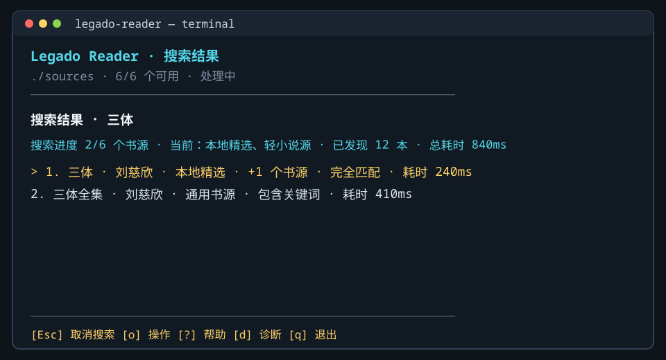
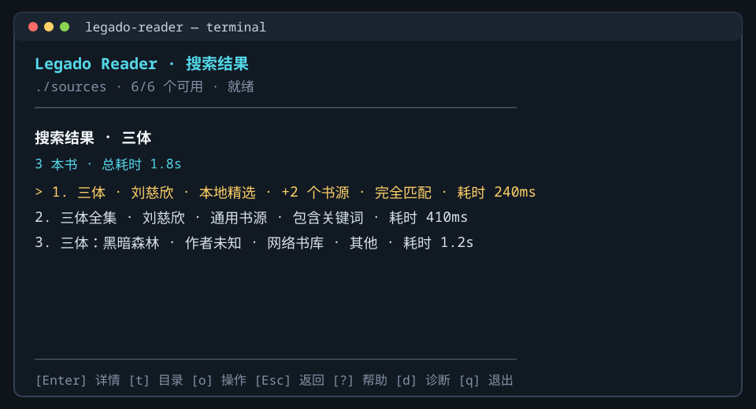
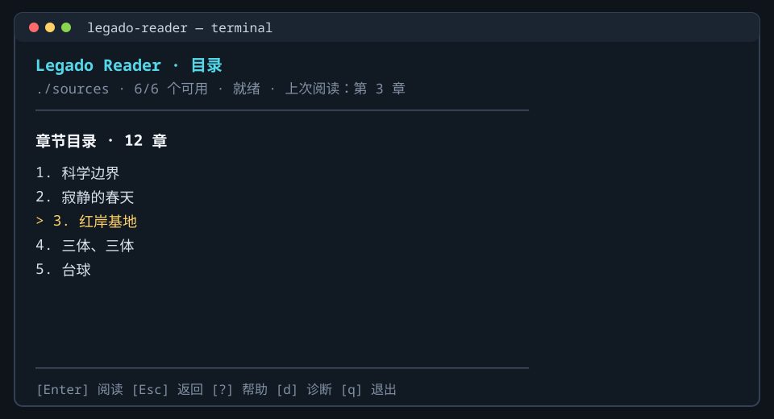
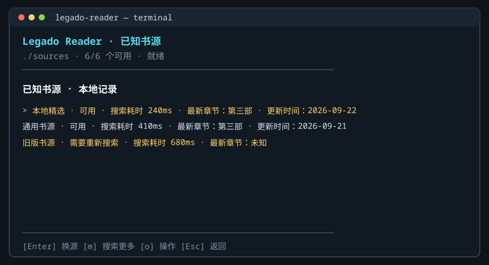
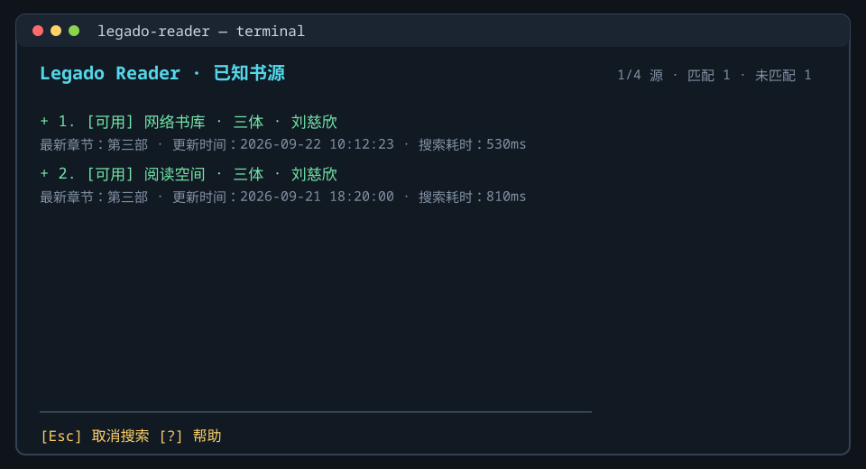
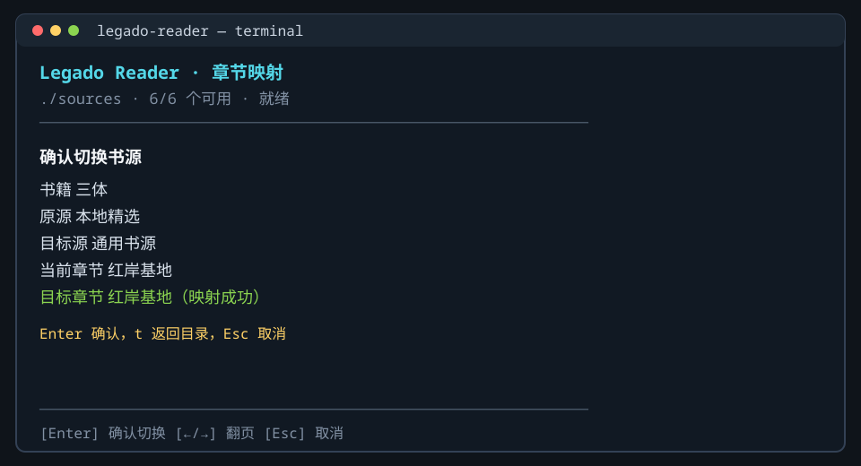

# 命令行阅读器交互设计

## 视觉和布局方向

界面采用原生终端的“编辑台”方向：终端默认背景、青色上下文、黄色焦点、白色正文和纯文本分隔线。颜色只是辅助，焦点、状态和错误始终通过文字和符号表达。页面不依赖鼠标，最小支持尺寸为 40×12；底部命令栏始终只使用一行，窄终端按动作优先级保留完整快捷键片段。至少 18 行时正文与命令栏之间显示分隔线。

每个页面由单行上下文、弹性正文区和固定命令栏组成。状态或错误摘要显示在上下文行，不额外挤占正文高度；输入页把光标和输入内容放在命令栏，快捷键完整显示在同一行。页面动作位于命令栏左侧，帮助、返回/取消和退出等通用操作在右侧；搜索、换源搜索和书源检测中的取消动作只保留左侧提示。详情、配置、帮助、设置和诊断是可返回页面；书架和搜索结果的 `o` 操作使用居中、带边框的临时覆盖层，底层页面保持可见，关闭后恢复原选择和视口。

## 页面流转

```text
启动/配置
   -> 首页 --s--> 设置
      -> 搜索编辑 -> 搜索结果 -> 详情 --↵--> 阅读
                                      \-> 目录 --↵--> 阅读
                                  \-> 已知书源 --t--> 书源目录预览 -> 阅读
                                                 \↵-> 切换/章节映射
首页 -> 书架/最近阅读恢复 ----------------------> 阅读
阅读 --i--> 详情 --↵（更新并返回）----------> 阅读
```

页面切换使用单一导航栈。搜索结果、详情、目录、阅读和书源页面按进入顺序创建实例；同一本书同一版本的阅读实例在栈顶时复用。首页、配置、设置、帮助、诊断和书源管理使用单例栈，再次打开时复用已有页面并清除其上方页面；调试页按书源身份保持单例。章节映射是临时页面，确认切换后用目录或详情替换映射页，取消时按普通返回处理。

详情页和阅读页的 `s` 始终打开本书“已知书源”页。该页面打开时只读取本地 `sources.json`，不会搜索。`t` 只读加载选中可用来源的目录；当前来源标为“当前”，其他有效来源标为“可用”。目录中选择章节并成功加载正文后，如果来自非当前来源，应用会更新活动来源及阅读记录。`↵` 保留原来的切换或章节映射流程，`m` 才进入扩展搜索。`o` 只在书架/最近阅读和搜索结果打开统一操作菜单；详情页不再提供该快捷键，目录、正文、书源和映射页也不显示或响应 `o`。`d` 在任意非输入页面打开诊断页，`v` 在搜索结果、详情、书源、目录和阅读页查看最近一次请求证据。

诊断页按书源显示状态和加载诊断。选中可用来源后按 `g` 进入单源调试，调试默认先执行搜索；按 `i` 修改关键词，按 `↵` 依次执行详情、目录和正文。调试页使用四个面板：`l` 处理流程、`n` 请求索引、`r` 当前原始响应、`p` 解析摘要。请求索引保留所有请求的摘要，但正文和响应头只显示当前选中项；按 `/` 过滤请求或当前响应。`y` 复制当前面板，`e` 导出完整脱敏会话。上述键位只在帮助页说明，不进入底部命令栏。

`⎋` 按真实导航栈逐层返回，不依赖固定页面映射。筛选输入中先退出/清除输入；任务运行时先取消并保留当前页面；帮助、设置和诊断返回它们打开前的页面。单例页面再次打开时会清除其上方实例，返回到该单例页面下方的页面。返回首页时重新读取书架、最近阅读和搜索记录；刷新完成前保留现有列表并显示更新状态。首页栈为空时 `⎋` 不跳页。通用帮助、返回/取消和退出提示固定在命令栏右侧，首页没有返回层级时省略返回提示；任务取消仍放在命令栏左侧。

从书籍信息页打开书源列表后，若使用 `↵` 直接切换来源，切换成功会回到原书籍信息条目并更新内容，不新增重复的详情历史页。若从其他页面进入书源列表，则保留原有导航路径。章节映射确认成功后进入目录或详情，映射页不会残留在返回链中。

## 页面预览

下面的图是按当前 `src/ui.tsx` 页面标题、状态文案、焦点样式和键位栏制作的静态 SVG 预览。它们用于查看页面结构，不代表某一次运行时的实时数据；书名、来源数量、时间和诊断内容会随本地数据、终端宽度变化。

### 启动与搜索




搜索进度图在顶部保留 `X/Y 源 · 已用时 · 候选数`，页面逐步显示候选，键位栏提供取消入口。搜索完成后，顶部继续显示结果数和总耗时；结果列表还展示绝对序号、完全匹配/包含关键词/其他、首个书源和单源搜索耗时。



### 书籍与阅读





### 书源与辅助页面








帮助页运行时按页面提供顶部 tabs，可查看配置、首页、搜索、结果、详情、目录、阅读、书源、章节映射、设置、诊断、调试和书源管理的帮助。Tab/Shift+Tab 或左右键切换页面，上下键滚动当前页面；每个 tab 保留自己的滚动位置。每个 tab 内按全局导航、页面操作、列表筛选和请求解析查看分组，分组之间用分割线分开，快捷键列固定缩进；终端变窄时 tabs 横向窗口化，正文在剩余高度内滚动。

完整资产位于 `docs/screenshots/`，新增或修改页面文案时应同步更新对应 SVG 和本节说明。

## 页面行为

### 首页

首页有三个区域：书架、最近阅读、搜索记录。每行显示从 1 开始的绝对序号；书架项显示书名、作者、当前章节和上海时区的上次阅读时间；最近阅读项显示 `[书架]` 或 `[未加入]`。未读但已加入书架的书只出现在书架，不会被伪造成阅读记录。搜索记录按规范化名称去重，只保留最新完成的一条，并显示 `YYYY-MM-DD HH:mm:ss` 搜索时间和候选数量。`j/k`、上下键逐项移动，左右键与 PageUp/PageDown 翻页，Home/End 或 Ctrl+A/Ctrl+E 跳到首尾。按 `s` 打开设置页。

### 设置页

设置页提供搜索、换源搜索和书源检测三项并发数，以及阅读页顶部书名、章节名、章序、页进度、字数、状态六项显示开关和连接符。并发数默认均为 4，允许保存 1–32 的整数；显示开关使用“显示/隐藏”，连接符支持“隐藏”、`·`、`—`，其中“隐藏”表示不绘制连接符，相邻项目之间只保留一个空格。上下键选择，Enter 编辑并再次保存；数值项用左右键移动光标，显示开关可按空格或左右键切换，连接符用左右键循环选择；Home/End 或 Ctrl+A/Ctrl+E 定位到数值首尾，Esc 取消当前编辑或返回，`r` 恢复默认值并要求确认。项目较多时设置正文区可滚动。设置保存到 `reader-settings.json`，只影响下一次批量操作；正在执行的任务继续使用启动时的并发值。

### 搜索结果

提交搜索后立即进入结果页，顶部显示 `已完成/总书源数 · 实时耗时 · 已发现候选数`；实时耗时每 250ms 更新，避免单个慢书源请求期间计时停滞。书源完成一个就推送一次快照；结果不需要等待全部书源结束即可浏览。搜索完成后顶部保留结果数和总耗时。结果按完全匹配、包含关键词、其他排序，同书名和作者的候选合并为一项，并显示绝对序号、首次返回书源、聚合书源数量和该候选搜索耗时；`j/k`、方向键逐项移动，左右键与 PageUp/PageDown 翻页，Home/End 或 Ctrl+A/Ctrl+E 跳到首尾。搜索期间按 `⎋` 会进入“正在取消”状态，等待应用层请求释放后留在结果页并保留已返回结果；只有非搜索状态下的 `⎋` 才返回上一页。

结果聚合键为规范化书名和作者；缺少必要字段时退回 `(sourceId, bookUrl)`。用户打开候选后，应用把本次结果中规范化书名和作者都一致的候选写入该逻辑书的已知书源集合。作者一致标记为 `title-author`，作者缺失或不同的候选不会误并入。

### 详情和目录

详情页显示书名、作者、当前书源、搜索耗时、最新章节、更新时间、简介和书架状态，并提供阅读、目录、换源和书架入口。长简介按终端宽度换行并支持滚动。目录使用带绝对序号的单列列表，焦点项用 `>`，阅读章节身份独立保存；按 `/` 在底部输入框搜索标题，匹配不区分大小写并先做 NFKC 规范化。按 `r` 绕过目录响应缓存重新请求目录，按 `s` 在正序和倒序间切换；两种操作都会按章节 URL 保留可用的焦点和当前阅读章节。筛选后尽量保留原焦点章节，若不再匹配则选择第一项；输入或筛选时 `⎋` 清除并恢复进入搜索前的焦点，再次 `⎋` 才返回。目录来自非当前来源时，上下文栏显示来源名和“预览”。目录加载失败时保留进入前页面。

### 阅读页

正文先将 HTML 转为终端可表达的结构化段落：标题使用 `#`、引用使用 `│`、列表使用项目符号或序号、`pre/code` 保留空白、`hr` 使用横线、图片显示替代文本占位。正文按可用列宽换行，连续的 HTML 普通段落不额外插入空行，纯文本中明确存在的段落空行仍会保留。阅读区先按实际显示行铺满视口，再进入下一页；上下键或 `j/k`、空格和 PageUp/PageDown 整页翻动，左右键或 `h/l` 切换上一章/下一章，`i` 打开书籍信息，`r` 绕过正文缓存刷新。阅读页不提供逐行滚动。顶部项目按设置显示，默认示例为 `三体 · 红岸基地 · 3/12章` 和 `3/12 · 1,234字 · 已加载`；连接符设为“隐藏”时，项目之间只有一个空格。状态文案会压缩为不超过六个字的短标签，例如“加载中”“刷新中”“已加载”“失败”，避免占用过多空间。字数统计不包含空白、渲染标记、分隔线和图片占位。章节切换前保留旧正文，目标正文成功后才替换视口。章末翻页不自动切章，避免误触网络请求。

阅读位置保存为段落索引和段内字符偏移，窗口缩放时先以旧版式取得段落锚点，再映射到新视口。书架或最近阅读按 `↵` 直接打开上次阅读章节；书籍信息页按 `↵` 直接打开正文，目录在后台加载以支持章节切换。阅读页按 `i` 打开书籍信息后，再按 `↵` 会更新原阅读页并移除详情页，不重复压入阅读页。正文按段落偏移恢复。直接阅读非当前来源的章节时，先加载正文并保存目标章节，再同步书籍元数据；若元数据同步失败仍保留已保存的阅读记录和正文，并提示“书籍信息待同步”。

### 已知书源

列表状态包括：

- `可用`：sourceId 和 sourceFingerprint 仍匹配当前来源目录。
- `需要重新搜索`：来源定义 fingerprint 已变化。
- `书源已移除`：当前来源目录没有该 sourceId。
- `定义冲突`：同一 sourceId 发现多个不同定义。

`t` 只允许对可用候选预览目录；列表项目使用两行，当前来源只显示 `[当前]`，不重复显示 `[可用]`，其他有效来源显示 `[可用]`，失效来源显示具体状态。已知书源和扩展搜索结果中的最新章节标题最多显示 20 个完整字符簇，不附加省略号。当前书源固定在最上面，其余按搜索耗时排序。`↵` 保留原来的活动来源切换/章节映射流程；`t` 不提交活动来源。目录中选择章节并成功读取非当前来源正文后，才提交该来源和阅读记录。`m` 只查询没有有效候选或 fingerprint 已变化的文本书源；扩展搜索结果在当前页增量展示，结束后只把书名和作者都完整匹配的候选合并到本地列表。

### 统一操作菜单

`o` 在首页书籍项或搜索结果项打开四项菜单：

1. 继续阅读：加载当前活动书源目录，并定位上次阅读章节。
2. 书籍信息：打开详情页。
3. 章节列表：加载当前活动书源目录。
4. 书源切换：打开本地已知书源列表。

菜单使用 `j/k` 或方向键选择、`1/2/3/4` 直接执行继续阅读、书籍信息、章节列表和书源切换，`↵` 执行、`⎋` 关闭。它以带边框的居中覆盖层显示，底层页面不会隐藏；当前页面动作、缺少书籍上下文、没有可用书源或普通异步操作期间会显示禁用原因。搜索结果中已经返回的候选仍可打开菜单，执行动作会先取消并等待其余书源结算。章节目录、正文、书源和映射页不显示该菜单。页面底部只使用一行提示当前可执行动作；阅读页底部省略翻页和切章节提示，完整键位说明保留在帮助页。

## 错误和取消

异步页面使用 `idle/running/cancelling/complete/cancelled/error` 语义。刷新时保留上一次可用内容，迟到结果不能更新已离开的页面。搜索快照和换源搜索快照都在书源结束后立即刷新；`⎋` 在搜索期间只取消任务，不离开结果/书源页，普通页面则返回上一页。`q` 退出并等待状态写入完成；非 TTY 环境拒绝启动交互界面。
