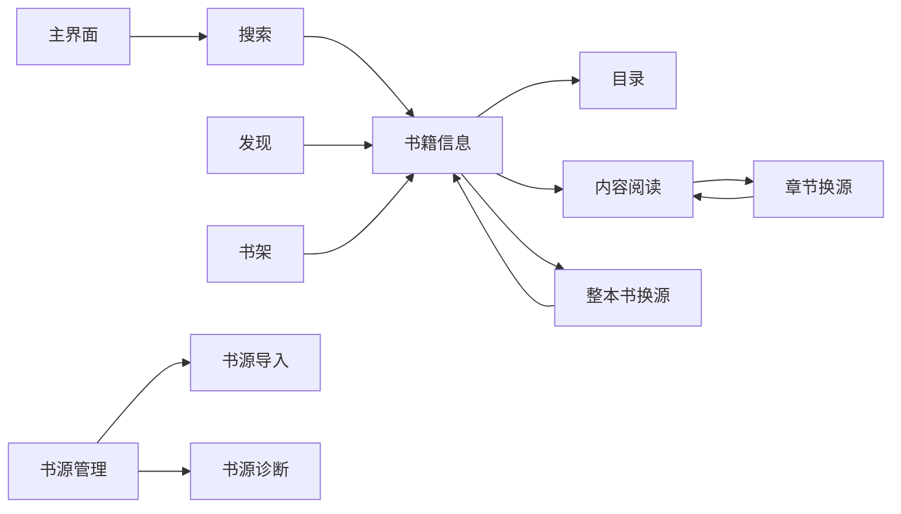

🥷 这里是 Android 功能对照资料。文档记录当前 Android 应用源码能够确认的页面入口、状态变化、请求顺序、持久化、副作用、异常和取消行为，供 `apps/` 和 CLI 实现逐页对照。

# Android 功能对照

## 文档边界

- **Android 页面快照**：当前 TypeScript 仓库上级目录中的 Android 工程，提交 `32a87b253e7cc28273c3850de86242caac83f1fd`，扫描日期 2026-09-28。长期规则和源码引用基线仍是 `62003ce732a7e30602754d28996da7f98b9ea296`，由[维护文档](../operations/package-maintenance.md)管理。
- **主要源码范围**：`app/src/main/java/io/legado/app/ui`、`model`、`data`、`utils`，以及对应 `res/menu`、`res/values-zh/strings.xml` 和相关测试。
- **证据等级**：正文中的源码事实来自静态代码和测试；没有真机运行证据的内容标为待验证，不把页面名称或旧文档描述当成实现事实。
- **与流程文档的关系**：`docs/flows/` 记录书源运行时的通用处理流程；本目录记录 Android 页面如何调用这些流程、保存数据和处理交互。

## 页面文档

| 页面 | 文档 | 重点 |
| --- | --- | --- |
| 主界面 | [overview.md](overview.md) | 底部导航、返回栈、恢复动作、页面入口 |
| 搜索 | [search.md](search.md) | 书源筛选、并发、请求、解析、合并、失败和分页 |
| 书籍信息 | [book-info.md](book-info.md) | 书籍恢复、详情和目录加载、书架状态、网页文件和操作菜单 |
| 目录 | [toc.md](toc.md) | 目录来源、搜索、卷折叠、定位、书签、高亮和导出 |
| 内容阅读 | [reader.md](reader.md) | 阅读初始化、正文加载、进度、菜单、缓存、标注和换源入口 |
| 整本书换源 | [source-switch.md](source-switch.md) | 搜索候选、附加详情和目录加载、排序、筛选、提交与回滚 |
| 书源导入 | [source-import.md](source-import.md) | 输入识别、解析、替换规则、本地比较、选择和保存 |
| 书源诊断 | [source-diagnosis.md](source-diagnosis.md) | 诊断输入、四类原始响应、日志、校验、超时和取消 |
| 书架 | [bookshelf.md](bookshelf.md) | 分组、排序、更新、导入、书架状态和批量操作 |
| 发现 | [explore.md](explore.md) | 发现源、分类、分页、筛选、结果和批量加入书架 |

## 页面之间的主链路

## 对照时必须保留的终态

每个页面文档都应明确记录 `loading`、`success`、合法空结果 `empty`、`partial`、`failed`、`cancelled` 和过期结果 `stale` 的区别。特别注意：Android 的部分网络任务会保留旧数据显示错误，部分任务会清空列表，部分任务会把失败吞掉后继续处理其他书源，不能统一成一个错误弹窗。

## 尚待运行验证

- 真机返回栈、进程重建、横竖屏恢复和系统返回键。
- 断网、超时、重复点击、取消后重新提交时的最终 UI 状态。
- 不同书源、书籍类型和配置组合下的页面差异。
- Android 页面状态与 `packages/source-core`、`packages/source-node`、`apps/reader-cli` 的输入输出是否逐字段一致。
